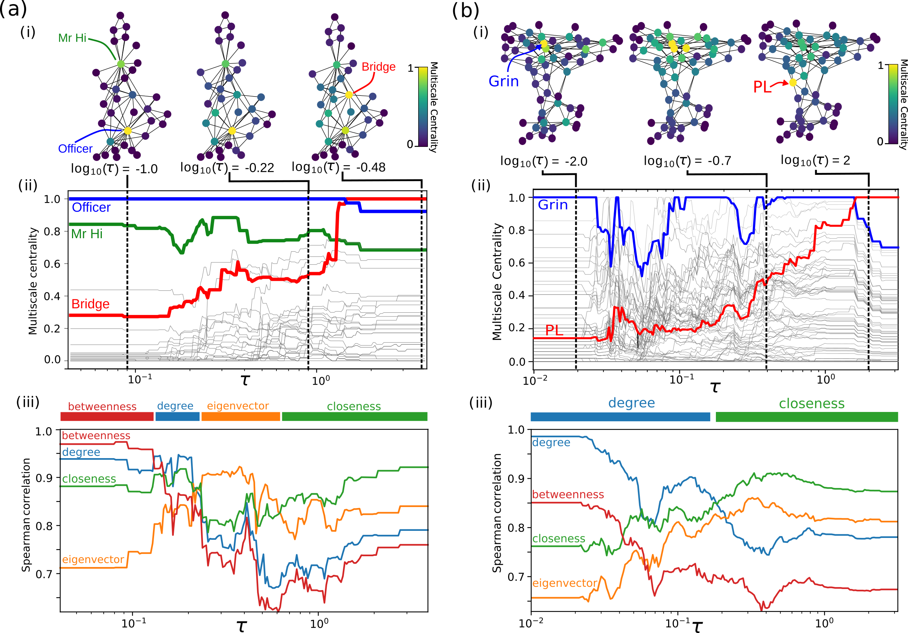

Multiscale Centrality
=====================

Multiscale centrality (MSC) is a scale dependent measure of centrality on complex networks. 

Classic measures of graph centrality capture distinct aspects of node importance, from the local (e.g., degree) to the global (e.g., closeness). Here we exploit the connection between diffusion and geometry to introduce a multiscale centrality measure. A node is defined to be central if it breaks the metricity of the diffusion as a consequence of the effective boundaries and inhomogeneities in the graph. Our measure is naturally multiscale, as it is computed relative to graph neighborhoods within the varying time horizon of the diffusion. We find that the centrality of nodes can differ widely at different scales. In particular, our measure correlates with degree (i.e., hubs) at small scales and with closeness (i.e., bridges) at large scales, and also reveals the existence of multicentric structures in complex networks. By examining centrality across scales, our measure thus provides an evaluation of node importance relative to local and global processes on the network.


The code in this repository implements the MSC algorithm and contains a small pipeline to run examples on classic graphs. 


<p align="center">
  
</p>

In the Figure above we can see the results of Multiscale Centrality applied to the Karate club network and the Dolphin interaction network. The Markov time is the scaling parameter, whereby at short timescales we identify locally central nodes (such as high degree nodes) whilst at long timescales we identify globally central nodes (such as high closeness). Notice how the positions of the central nodes changes as mapped onto the original network structures.


For more information please see our published [paper](https://journals.aps.org/prresearch/abstract/10.1103/PhysRevResearch.2.033104).


## Cite

Please cite our paper if you use this code in your own work:

```
Arnaudon, Alexis, Robert L. Peach, and Mauricio Barahona. "Scale-dependent measure of network centrality from diffusion dynamics." Physical Review Research 2.3 (2020): 033104.
```

The bibtex code:

```
@article{arnaudon2020scale,
  title={Scale-dependent measure of network centrality from diffusion dynamics},
  author={Arnaudon, Alexis and Peach, Robert L and Barahona, Mauricio},
  journal={Physical Review Research},
  volume={2},
  number={3},
  pages={033104},
  year={2020},
  publisher={APS}
}
```

## Installation

Required packages: numpy/scipy/matplotlib/networkx/forceatlas2 . 

To install, run in the main folder:

```python setup.py install```

## Tests

In the example folder, the script ``compute_multiscale_centrality.py`` can be used to run the benchmark examples in the paper:
```python compute_multiscale_centrality.py GRAPH_NAME```
where ``GRAPH_NAME`` could be:
* ``karate``
* ``celegans``
* ``delaunay``


Alternatively, the Multiscale Centrality can easily be adapted to be applied to other graphs - see the readme in the test folder.  

For a quick start, check out our [examples](https://github.com/barahona-research-group/MultiscaleCentrality/tree/master/test) in the `test/` directory.


## Our other available packages

If you are interested in trying our other packages, see the below list:
* [GDR](https://github.com/barahona-research-group/GDR) : Graph diffusion reclassification. A methodology for node classification using graph semi-supervised learning.
* [hcga](https://github.com/barahona-research-group/hcga) : Highly comparative graph analysis. A graph analysis toolbox that performs massive feature extraction from a set of graphs, and applies supervised classification methods.

